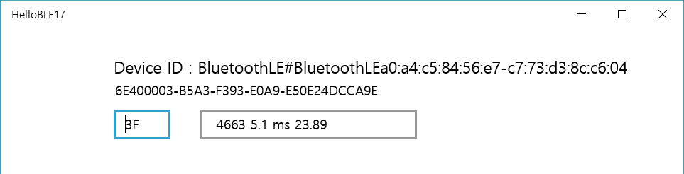
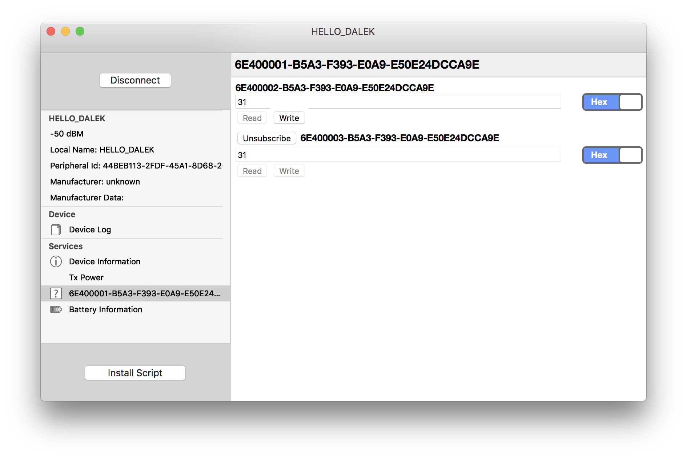
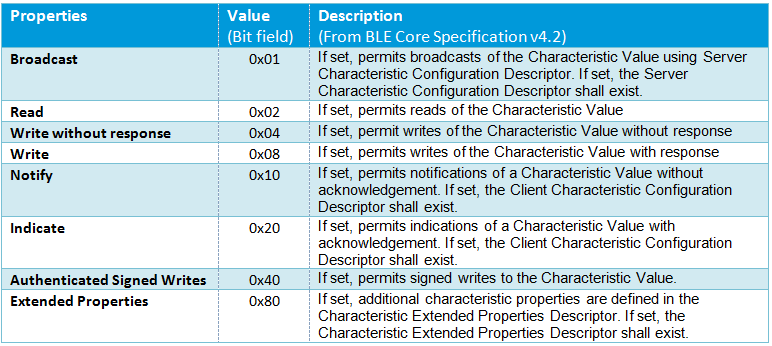

# BLEApp

### Desktop BLE applications

#### Windows 10
* Bluetooth LE Explorer
* HelloBLE17 : See SW/HelloBLE17 (개발 진행중, Under development)



#### MacOS
* BlueSee



### Characteristic Properties

* A custom UART service
```
6E400001-B5A3-F393-E0A9-E50E24DCCA9E for the Service
6E400002-B5A3-F393-E0A9-E50E24DCCA9E for the TX Characteristic (Property = Notify)
6E400003-B5A3-F393-E0A9-E50E24DCCA9E for the RX Characteristic (Property = Write without response)
```


See https://devzone.nordicsemi.com/nordic/short-range-guides/b/bluetooth-low-energy/posts/ble-characteristics-a-beginners-tutorial for more details

### TODO
* Developing the desktop app.

### References
* Adafruit_nRF8001 https://github.com/adafruit/Adafruit_nRF8001/blob/master/README.md
